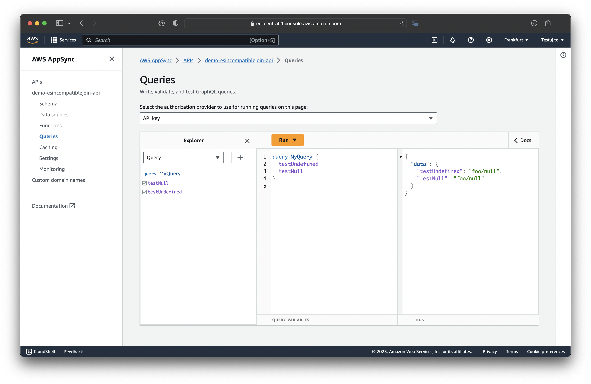

# Reproduction of AS-Script bug

_Original issue can be found here: [https://github.com/aws/aws-appsync-community/issues/335](https://github.com/aws/aws-appsync-community/issues/335)_

1. Clone the repo
  ```bash
  git clone https://github.com/testuj-to/appsync-esv6-incompatible-join.git
  cd appsync-esv6-incompatible-join
  ```
2. Run `make deploy`
3. Test the output in AppSync console
4. Run `make destroy`

## Screenshot of execpected output


